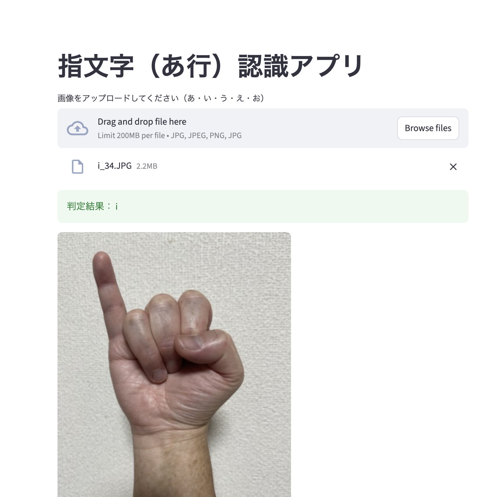

# 指文字（あ行）認識AIアプリ  
MediaPipe Handsで抽出した手のランドマーク座標を用いて、  
「あ・い・う・え・お」の指文字を認識する機械学習モデルとWebアプリです。

---

## 📌 概要
このプロジェクトは、手話の指文字（あ行）を静止画から判定するアプリケーションです。  
MediaPipeによる特徴点抽出 → RandomForestによる学習 → StreamlitでWebアプリ化  
という **機械学習の一連の流れ** をまとめています。

学習と推論の両方を理解できる実践的なプロジェクトです。

---

## 🧠 使用技術
- Python 3.x  
- MediaPipe Hands  
- OpenCV  
- RandomForestClassifier（scikit-learn）  
- NumPy / Pandas  
- Streamlit（Webアプリ化）

---

## 🏗 プロジェクト構成
```
sign-fingerspell-ai/
├── sign_app/
│   ├── app.py                 # Streamlit アプリ本体
│   ├── ai_model.pkl           # 学習済みモデル
│   └── landmarks_extract.py   # MediaPipe でランドマーク抽出
│
├── notebooks/
│   ├── 01_landmark_extraction.ipynb   # 特徴点抽出処理
│   └── 02_training_model.ipynb        # モデル学習
│
├── data/ （必要に応じて公開しない）
├── requirements.txt
└── README.md
```

---

## 📸 アプリ画面（スクリーンショット）

### 📌 トップ画面


### 📌 画像アップロード画面


### 📌 判定結果



## 🚀 使い方（ローカル実行）
### 1. 必要なライブラリをインストール
```
pip install -r requirements.txt
```

### 2. アプリを起動
```
streamlit run app/app.py
```

### 3. ブラウザで確認
```
http://localhost:8501
```

---

## 🎯 学習モデルについて

### ● 特徴量（63次元）  
MediaPipe Hands の 21点 × (x, y, z) の座標を使用。

### ● モデル  
- RandomForestClassifier  
- 5クラス分類（あ・い・う・え・お）

---

## 📊 モデル精度
（例、後で差し替え可能）

- Accuracy：92.3% 
- Confusion Matrix：あり  
- 指文字のランドマークにばらつきがある場合は misclassification あり

---

## 🔧 工夫したポイント
- **ランドマーク抽出の安定化**：MediaPipe Hands で特徴点が正しく取れない角度の画像を除外し、誤判定を防止。
- **特徴量63次元の前処理を自動化**：x・y・z座標の正規化や欠損除去など、学習前処理を関数化して再現性を向上。
- **使いやすさを重視したUI**：Streamlit を用いて、画像を選ぶだけで指文字判定できる Web アプリとして実装。
- **クラスごとのデータ数を調整**：クラス不均衡による偏りを避けるため、各クラスの枚数を揃えて学習。

---

## 🔮 今後の改善案
- 学習データの増加で精度向上  
   → 特に「え」「お」は形状が似ているため、データ追加で誤判定対策に有効。
- スマホカメラ対応（リアルタイム認識）  
   → アクセシビリティ用途として実用性が高まる。
- CNN などのDeep Learning モデルへの拡張  
   → より複雑な手形状を高精度で分類できる可能性がある。
- 動作を含む手話認識への応用  
   → 静止画の指文字から、動画ベースの手話文への発展が期待できる。

---

## 👤 制作者
**山田真一郎（やま）**  
Python / データサイエンス / 画像認識を学習中  
Webアプリや機械学習モデルの開発経験あり

---

## 📄 ライセンス
This project is licensed under the MIT License.
